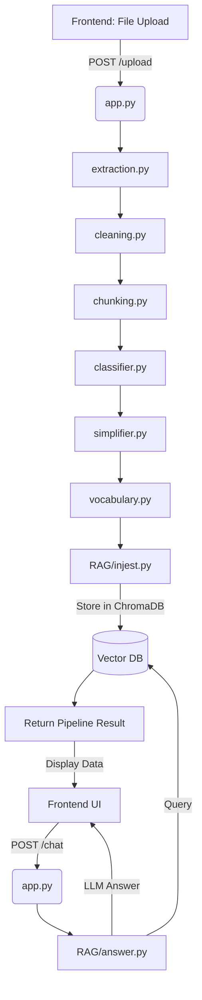

# ⚖️ JanNyaya — Legal AI for Common Citizens

[](https://react.dev/)
[](https://vite.dev/)
[](https://flask.palletsprojects.com/)
[-orange?style=flat-square)](https://ollama.com/)
[](https://www.trychroma.com/)
[](LICENSE)

**JanNyaya** is an advanced, end-to-end Legal AI system designed to make complex, legalese-heavy legal documents accessible and understandable to the general public. It processes scanned or digital legal documents through an intelligent processing pipeline, translates them into multiple regional Indian languages, extracts legal terms for tooltips/glossaries, and powers a session-bound RAG (Retrieval-Augmented Generation) chat assistant.

---

## 🧠 System Architecture & Data Flow

JanNyaya leverages a modular pipeline to transition raw, complex legal files into structured, simplified, and queryable data:



### The 8-Stage Processing Pipeline

1. **Upload & Extraction**: Supports PDFs (scanned and digital), DOCX, Images (`.png`, `.jpg`, `.jpeg`, `.webp`), and TXT. Scanned documents undergo Tesseract OCR processing.
2. **Legal Text Cleaning & Normalization**: Fixes Unicode issues, standardizes whitespace, and removes distracting headers/page artifacts.
3. **Semantic Chunking**: Splits large documents into token-optimized segments preserving legal contexts.
4. **Classification**: Labels segments (e.g., *Case Details*, *Parties*, *Facts*, *Arguments*, *Evidence*, *Legal Issues*, *Court Reasoning*, *Judgment*) with confidence scores.
5. **Dual-Phase Simplification**:
   - **Phase 1**: Rephrases each classified chunk into plain English.
   - **Phase 2**: Synthesizes the simplified chunks into a structured **Master Summary** (Markdown).
6. **Vocabulary Extraction**: Identifies complex legal jargon and generates simple, layperson definitions.
7. **RAG Ingestion**: Embeds chunks using `SentenceTransformer (all-MiniLM-L6-v2)` and inserts them into an in-memory `ChromaDB` collection mapped to a unique session ID.
8. **Multilingual Translation**: Translates summaries and chatbot responses into target regional languages (Hindi, Tamil, Telugu, Kannada, Malayalam).

---

## 🛠️ Tech Stack

### Frontend
- **Framework**: React 19 (Vite build tool)
- **State Management**: Zustand
- **Styling**: Vanilla CSS (custom layout system)
- **HTTP Client**: Axios
- **Animations & MD Rendering**: Framer Motion, React Markdown

### Backend
- **Framework**: Flask with Flask-CORS
- **OCR & Document Extraction**: `pdfplumber`, `pdf2image` (Poppler), `python-docx`, `pytesseract`, `Pillow`, `OpenCV` (for image binarization & preprocessing)
- **AI/LLM Integration**: OpenAI Client (connecting to local **Ollama** or Gemini/OpenRouter API endpoints)
- **Embeddings & Vector Database**: `SentenceTransformers` (`all-MiniLM-L6-v2`), `ChromaDB` (In-memory)
- **Translation**: `deep-translator` (Google Translator API wrapper)

---

## 🚀 Installation & Local Setup

### Prerequisites
- [Node.js](https://nodejs.org/) (v18 or higher)
- [Python](https://www.python.org/) (v3.10 or higher)
- [Ollama](https://ollama.com/) (installed and running locally)

---

### 1. External Dependencies Setup (Critical for OCR)

Because the project extracts text from scanned PDFs and images, it depends on two external binaries. You must configure these on your system:

#### A. Tesseract OCR
1. Download and install [Tesseract OCR for Windows](https://github.com/UB-Mannheim/tesseract/wiki).
2. By default, the backend expects Tesseract to be installed at:  
   `C:\Program Files\Tesseract-OCR\tesseract.exe`
3. If your installation path is different, modify line 10 in `backend/services/extraction.py`:
   ```python
   pytesseract.pytesseract.tesseract_cmd = r"/your/custom/path/to/tesseract.exe"
   ```

#### B. Poppler (for PDF to Image conversions)
1. Download the latest Poppler binary release (e.g., from [this link](https://github.com/oschwartz10612/poppler-windows/releases/)).
2. Extract the folder. The backend expects the binaries to be located at:  
   `C:\poppler-25.12.0\Library\bin`
3. If you extract it to another location, modify line 11 in `backend/services/extraction.py`:
   ```python
   POPPLER_PATH = r"C:\path\to\your\poppler\Library\bin"
   ```

---

### 2. Backend Installation

1. Navigate to the `backend` directory:
   ```bash
   cd backend
   ```
2. Create and activate a Python virtual environment:
   ```bash
   python -m venv .venv
   
   # On Windows (PowerShell)
   .\.venv\Scripts\Activate.ps1
   
   # On macOS/Linux
   source .venv/bin/activate
   ```
3. Install the required Python packages:
   ```bash
   pip install -r requirements.txt
   ```
4. Start Ollama and download the LLM model (default is `llama3`):
   ```bash
   ollama pull llama3
   ```
5. Run the Flask development server:
   ```bash
   python app.py
   ```
   The backend API will run on `http://127.0.0.1:5000`.

---

### 3. Frontend Installation

1. Navigate to the `frontend` directory:
   ```bash
   cd ../frontend
   ```
2. Install the node modules:
   ```bash
   npm install
   ```
3. Run the Vite development server:
   ```bash
   npm run dev
   ```
   Open your browser and navigate to `http://localhost:5173`.

---

## 🔌 API Reference

### 1. Upload & Process Document
Processes a file through the full parsing, classification, simplification, vocabulary extraction, and RAG ingestion pipeline.

* **Endpoint**: `/upload`
* **Method**: `POST`
* **Content-Type**: `multipart/form-data`
* **Payload**: `file` (Supported: `.pdf`, `.docx`, `.png`, `.jpg`, `.jpeg`, `.webp`, `.txt`)
* **Success Response (200 OK)**:
  ```json
  {
    "raw_text": "...",
    "cleaned_text": "...",
    "chunks": [
      {
        "text": "...",
        "label": "Facts",
        "confidence": 1.0
      }
    ],
    "chunks_count": 1,
    "final_output": "## Document Type: Court Order\n...",
    "vocab": {
      "terms": [
        {
          "term": "Interlocutory Application",
          "meaning": "A request made to a court for a temporary order while a main case is still pending."
        }
      ]
    }
  }
  ```

### 2. Legal Assistant Chat (RAG)
Queries the vector database (ChromaDB) containing the uploaded document context.

* **Endpoint**: `/chat`
* **Method**: `POST`
* **Payload**:
  ```json
  {
    "question": "What is the court's final decision?"
  }
  ```
* **Success Response (200 OK)**:
  ```json
  {
    "answer": "The court dismissed the application for amendment..."
  }
  ```

### 3. Translate Text
Translates text segments into one of the supported Indian regional languages.

* **Endpoint**: `/translate`
* **Method**: `POST`
* **Payload**:
  ```json
  {
    "text": "The court dismissed the case.",
    "language": "Hindi"
  }
  ```
* **Supported Languages**: `Hindi`, `Tamil`, `Telugu`, `Kannada`, `Malayalam`
* **Success Response (200 OK)**:
  ```json
  {
    "translated_text": "अदालत ने मामला खारिज कर दिया।"
  }
  ```

### 4. Session Cleanup
Deletes the temporary ChromaDB vector collection generated for the session.

* **Endpoint**: `/cleanup`
* **Method**: `POST`
* **Success Response (200 OK)**:
  ```json
  {
    "status": "deleted"
  }
  ```

---

## ⚙️ Configuration & Model Tweaking

By default, the backend connects to Ollama's local compatibility layer. You can adjust model selection and APIs in `backend/app.py`:

```python
# Select your local Ollama model
MODEL_NAME = "llama3"  # Alternative options: "qwen2.5:3b", "mistral:7b"

# Connection to local Ollama API
client = OpenAI(
    base_url="http://localhost:11434/v1",
    api_key="ollama"
)
```

To switch to **Gemini API** or **OpenRouter**, uncomment the corresponding blocks inside `backend/app.py`:
```python
# Gemini Configuration Example
# MODEL_NAME = "gemini-2.5-flash-lite"
# client = OpenAI(
#     base_url="https://generativelanguage.googleapis.com/v1beta/openai/",
#     api_key="YOUR_GEMINI_API_KEY"
# )
```

---

## 🎨 UI/UX Features Built into the Frontend

- **Multi-Step Process Loading**: Since `/upload` triggers extraction, classification, and summaries, the frontend shows an active multi-step loading animation representing each backend stage.
- **Color-Coded Semantic Chunking**: Chunks are displayed in the UI with distinct, color-coded badges matching their category labels (e.g., Red for *Judgment*, Blue for *Facts*).
- **Interactive Glossary & Tooltips**: Words found in the extracted vocabulary dictionary are highlighted in the document preview; hovering over them displays the simplified citizen-friendly meaning.
- **State Management & Auto-cleanup**: Utilizes Zustand for state sync and auto-clears ChromaDB vector caches when the tab or window is closed (listening to `beforeunload`).

---

## 📄 License
This project is licensed under the MIT License. Feel free to modify and expand it for any public interest or legal access initiatives!
